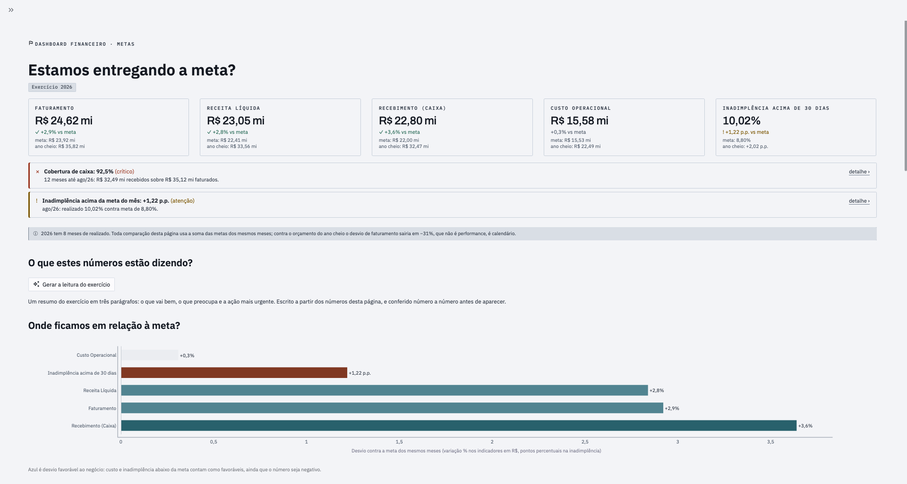

# Dashboard Financeiro — locadora de frotas B2B

> ### Faturamento e caixa estão acima da meta. A crise é de crédito, não de receita.

Painel de cinco páginas que responde uma pergunta de negócio por tela. Streamlit sobre um
snapshot Parquet de 459 KB versionado no próprio repositório, com a regra de negócio numa
camada semântica testada por **116 verificações** contra números conferidos.

<p align="center">
  <a href="https://dashboard-financeiro-rdev.streamlit.app"></a>
</p>

<p align="center">
  <a href="https://dashboard-financeiro-rdev.streamlit.app"><b>Abrir o painel</b></a>
  &nbsp;·&nbsp;
  <a href="docs/">Documentos de projeto</a>
</p>

## O que os dados mostram

A tese não saiu de um briefing, saiu dos números. Em 2025 a empresa **bateu a meta de
faturamento estourando a de custo**, e o caixa fechou negativo no mesmo ano em que a
receita foi positiva: a assinatura de crescimento financiado por prazo.

| Exercício | Faturamento | Recebimento | Custo | Inadimplência acima de 30 dias |
|---|---|---|---|---|
| 2024 | −2,7% | −4,7% | −2,1% | 3,56% *(meta 3,00%)* |
| 2025 | **+6,8%** | −2,9% | **+8,2%** | **10,20%** *(meta 3,00%)* |
| 2026 *(8 meses)* | +2,9% | +3,6% | +0,3% | 10,02% *(meta 8,00%)* |

Um desvio de **+7,20 pontos percentuais** na inadimplência de 2025, o maior do dataset por
uma ordem de grandeza. O orçamento de 2026 reconheceu a realidade e revisou a meta para
8,00%; ainda assim o realizado está em 10,02%.

Três achados que o painel expõe e que não estavam na pergunta original:

- **O rating de crédito funciona, e ninguém está usando.** Um cliente D erra 25 vezes mais
  que um A (16,94% contra 0,67%), mas os clientes C têm o **maior limite médio da base**,
  50% acima dos A. Há **R$ 1,33 mi em aberto acima dos limites aprovados**, em 13 de 49
  clientes. O limite nunca foi calibrado pelo risco.
- **Os veículos parados não estão esperando cliente, estão quebrados.** 40,5% do custo do
  veículo sem contrato é manutenção e pneu. Não é problema comercial, é de oficina.
- **A empresa gasta 3,7 vezes mais consertando do que prevenindo** (R$ 8,00 mi de
  manutenção corretiva contra R$ 2,16 mi de preventiva). É a decisão isolada mais cara do
  painel de custos, e está sendo tomada por omissão.

## O que este projeto demonstra

- **Camada semântica única e testada.** Só um módulo escreve SQL, e 116 verificações
  comparam o que ele calcula com números conferidos. A pergunta "esse número está certo?"
  tem uma resposta executável.
- **Invariantes verificados por máquina, não combinados.** Seis portões rodam em 3,5 s:
  nenhum nome de coluna do banco na tela, nenhuma cor escrita fora do tema, contraste e
  daltonismo medidos, e nenhum número sem procedência — inclusive nos textos escritos por
  modelo de linguagem.
- **As armadilhas do domínio, tratadas e documentadas.** Corte point-in-time de
  cancelamento (sem ele a inadimplência infla de 9,4% para 18,7%), comparação de meta por
  período casado em ano parcial, e o descasamento de 1 a 3 meses entre faturar e receber.
- **Desempenho por decisão de arquitetura.** A página mais pesada saiu de 12 s para 0,33 s
  ao trocar a conexão viva por um snapshot local, sem reescrever uma linha de SQL.

Os cinco documentos de projeto estão em [`docs/`](docs/): briefing, KPIs, arquitetura, UX e
handover. Eles registram **por que** cada decisão foi tomada, incluindo as revertidas.

## Rodando

Há uma versão publicada em **[dashboard-financeiro-rdev.streamlit.app](https://dashboard-financeiro-rdev.streamlit.app)**. Para rodar local:

```bash
pip install -r requirements.txt
streamlit run streamlit_app.py
```

Não precisa de credencial nem de banco: o dataset viaja no repositório.

### Os dados ficam no projeto

O app **não conecta em banco nenhum**. Ele lê `dados/*.parquet`, oito arquivos que somam
459 KB e estão versionados aqui, e consulta esses arquivos com DuckDB em processo. Não há
servidor, não há rede e não há credencial: `git clone` + `pip install` e o app roda.

Para regerar o snapshot quando o dataset de origem mudar:

```bash
pip install -r requirements-dev.txt
python3 scripts/exportar_dados.py
```

Esse script é a **única** parte do repositório que fala com o Supabase, e ele não roda no
app. Ele precisa de `PG_DSN` (`st.secrets`, variável de ambiente ou `.env` da raiz) e nunca
imprime o valor do segredo, só a origem consultada. `.env` e `.streamlit/secrets.toml`
continuam no `.gitignore`.

**Por que DuckDB e não pandas.** A camada semântica inteira é SQL, e é nela que moram as
armadilhas do dataset: corte point-in-time de cancelamento, janela de 12 competências,
meta por período casado. Reescrever isso em pandas jogaria fora as verificações que validam
exatamente aquele SQL. Com DuckDB o texto das consultas continua o mesmo que rodava no
Postgres — duas diferenças de dialeto foram resolvidas de forma portável (`generate_series`
no `FROM` em vez da lista do `SELECT`; `interval '1 month' - interval '1 day'` no lugar do
literal composto) e `to_char` entra por macro, sem tocar nas consultas.

**O que isso custou em tempo de carregamento**, medido antes e depois:

| | Supabase (pooler) | Snapshot local |
|---|---|---|
| Metas | ~12 s | **0,33 s** |
| Faturamento e Recebimento | ~2 s | **0,06 s** |
| Inadimplência | ~2 s | **0,08 s** |
| Custos | ~2 s | **0,06 s** |
| Suíte de verificação completa | ~82 s | **3,5 s** |

## Leitura executiva (opcional)

A página de Metas tem um bloco **"O que estes números estão dizendo?"**: um botão que
gera, pela API do Claude, o briefing do exercício em três parágrafos — o que vai bem, o
que preocupa e a ação mais urgente.

**O modelo não tem acesso a dado nenhum.** Ele não vê SQL, não vê os arquivos e não
calcula. Recebe um dicionário com os números que `frotas/metrics/` já apurou — os mesmos
que as verificações cobrem — e o trabalho dele é interpretar e priorizar.

E isso é verificado, não prometido. `frotas/leitura.py` extrai **todo número do texto
gerado** e exige que cada um corresponda a um valor do payload, com a tolerância de
arredondamento do próprio texto (`92,5%` casa com `92,5126`; `R$ 3,52 mil` não casa com
`R$ 3,52 mi`). Um número sem procedência **reprova a resposta inteira**: o app tenta uma
vez mais dizendo qual número reprovou e, se falhar de novo, não mostra briefing nenhum.
Número sem procedência não vai para a tela, venha ele de uma consulta errada ou de um
modelo.

```bash
# no .env da raiz (desenvolvimento local)
ANTHROPIC_API_KEY=sk-ant-...
```

### Ligada local, desligada na versão publicada

**A presença da credencial é o interruptor**, e por isso não existe detecção de ambiente
no código. Na máquina de desenvolvimento a chave está no `.env` e o botão funciona; no
Streamlit Cloud o segredo simplesmente **não é configurado**, o botão aparece desabilitado
e o visitante lê o recado explicando por quê. Um único caminho de código para os dois
casos, sem flag para alguém esquecer de virar.

Ou seja: **para publicar, não faça nada.** Não adicione `ANTHROPIC_API_KEY` aos segredos
do Streamlit Cloud e a leitura executiva já sobe desligada.

Nenhum número da tela depende disso — é um recurso opcional em cima da camada de
métricas, nunca dentro dela. A chamada é sob demanda (só no clique), cacheada por
payload, e custa alguns centavos por leitura.

`scripts/verificar_leitura.py` testa o verificador com 18 casos e **roda offline**: não
chama a API nem gasta crédito. Ele entra na suíte do `verificar_tudo.py`.

## Identidade visual

O app veste a **camada de dados do [Bancada](../Bancada%20Design%20System)**, o design
system do portfólio. A tese do sistema é *"a bancada é escura, os artefatos são claros"*:
um dashboard construído na camada clara **é** o artefato que o site escuro enquadra, então
a captura de tela dele entra numa moldura do portfólio sem tratamento nenhum.

Do sistema vêm as superfícies (`#F4F6F8` sobre `#E6EBEF`), os seis matizes categóricos, os
três sinais recalibrados para fundo claro, as escalas sequencial e divergente, e as três
fontes com papel definido: **Archivo** no número herói, **IBM Plex Sans** no corpo e nos
números de tabela e eixo, **IBM Plex Mono** só em rótulo e procedência.

Duas coisas nós **não** adotamos, com a razão registrada em `docs/03_ux.md`: a escala de
tamanhos (a do Bancada é de site com prosa; esta é de painel denso) e os glifos `▲ ▼` (os
nossos `✓ ! !! ✕` codificam favorabilidade, não direção — é o que impede pintar de verde
uma inadimplência que subiu).

**Um tema só.** O app é claro por tese, não por gosto.

O rodapé leva a assinatura do autor, o link do portfólio e a ressalva sobre o dataset
sintético. Ele é chamado **uma vez** no entrypoint, depois de `pagina.run()`: o rodapé é
do app, não de cada página, e assim não há como uma esquecer. Segue o `Footer` do Bancada
— separado do conteúdo por fio, nunca por inversão de fundo, e acromático, porque a cor
pertence ao dado.

## Escopo — cinco eixos

Faturamento · Recebimento · **Inadimplência na posição atual** · Metas · Custos.

Fora de escopo por decisão de projeto: margem operacional, análise de contratos,
concentração de carteira, recuperação de crédito e toda série retroativa de
inadimplência. A inadimplência é uma **foto na data de referência**, nunca uma série.

## Guia e quatro páginas

O menu lateral leva o **nome curto**; a **pergunta de negócio** é o título dentro da página.

| Menu | Pergunta central (título da página) | Público |
|---|---|---|
| Guia | Como ler este dashboard? | quem abre pela primeira vez |
| Metas | Estamos entregando a meta? | CFO |
| Faturamento e Recebimento | Quanto faturamos e quanto entrou em caixa? | Controller / CFO |
| Inadimplência | Quanto está em aberto hoje, e com quem? | Gerente de crédito e cobrança |
| Custos | Para onde vai o custo? | Gerente de operação e frota |

Toda página abre com o mesmo cabeçalho: **Dashboard Financeiro · <seção>**, a pergunta
de negócio como título, e os **chips de contexto**, que repetem os filtros em uso. Os chips
ficam no topo, e não num rodapé, porque contexto de apuração se lê antes do número, e porque
o recorte só existia na barra lateral, invisível com ela recolhida.

**Cada página exibe apenas os filtros que mudam os números dela** (`FILTROS_DA_PAGINA` em
`views/_comum.py`, derivado de `filtros.politica_filtros()`). Metas troca o período por um
seletor de **exercício**, porque tudo ali é por ano, e não lista porte, rating, tipo de
contrato nem cliente, porque o orçamento só existe nos níveis Empresa e Segmento;
Inadimplência não lista período, porque a página é uma leitura numa data; Custos não lista
data, porque seus números são todos por competência. Filtro visível que
não faz nada é pior que filtro nenhum: o usuário mexe e conclui que o dashboard quebrou.

**Granularidade do eixo temporal**: as páginas com série (Metas, Faturamento e Recebimento,
Custos) trazem **Agrupar o tempo por** — mês, trimestre ou ano. Cada coluna declara como se
agrega (`reagrupar()` em `views/_comum.py`): reais somam, a inadimplência é fim de período
(o trimestre é o valor do último mês, nunca a soma dos três) e a ociosidade é recalculada
como veículos-mês parados sobre veículos-mês de frota. **Semana não existe** e não é
omissão: `titulos_receber.competencia` e `custos.competencia` são sempre dia 1 do mês, e a
meta é mensal por definição. Só `data_pagamento` tem grão diário.

Duas regras editoriais que o código sustenta: **uma pergunta central por página,
declarada no título**, e **no máximo um bloco curto de texto por página** — o resto é
rótulo, nota de rodapé do visual ou tooltip.

## Estrutura

```
streamlit_app.py          entrypoint: st.navigation, filtros globais, estado compartilhado
dados/                    o dataset em Parquet, uma tabela por arquivo (459 KB)
frotas/
  config.py               constantes de negócio e os segredos (exportador e leitura)
  leitura.py              leitura executiva: payload, chamada e verificação de procedência
  db.py                   DuckDB sobre dados/, cache, guarda SELECT/WITH, erros tipados
  filtros.py              dataclass Filtros (frozen/hashável) + política de filtros
  metrics/                camada semântica — a única que escreve SQL
    receita.py  credito.py  custos.py  metas.py  alertas.py  dimensoes.py
  ui/
    theme.py              tokens do Bancada, paleta validada para daltonismo, layout Plotly
    format.py             formatação pt-BR (R$, %, p.p., competência, delta)
    rotulos.py            dicionário único coluna → rótulo legível (149 colunas)
    componentes.py        tiles, banners, tabelas, seletores
views/                    guia + uma página por pergunta, mais _comum.py
scripts/
  exportar_dados.py       regera dados/ a partir do Supabase (só isto usa credencial)
  verificar_tudo.py       roda as quatro verificações; use antes de commitar
  validar_metricas.py     116 verificações contra os números publicados
  verificar_rotulos.py    falha se nome de coluna, travessão ou cifrão cru chegar à tela
  verificar_leitura.py    18 casos do verificador de procedência (offline, sem custo)
  verificar_tema.py       invariantes visuais: hex, espelho do config, contraste, daltonismo
docs/                     00 briefing · 01 KPIs · 02 arquitetura · 03 UX · 04 handover
```

## Validação

```bash
python3 scripts/verificar_tudo.py
```

Roda tudo de uma vez e só devolve 0 se as seis passarem: `pyflakes`, as métricas,
os rótulos, o verificador da leitura executiva, os invariantes visuais e o render
das cinco páginas. **Chame antes de commitar.**

```bash
python3 scripts/validar_metricas.py
```

Roda a camada semântica contra o banco e compara com os números de referência de
`DICIONARIO_DADOS.md`. Saída esperada: **116/116 obrigatórias OK**, 3 informativas
(divergências de definição documentadas em `docs/04_handover.md`).

Cobre, entre outros: faturamento, receita líquida e custos dos três anos; inadimplência
na data de referência em quatro pontos; aging casa a casa; realizado × meta de
faturamento e recebimento; e o nível esperado dos 13 alertas.

```bash
python3 scripts/verificar_rotulos.py
```

Renderiza todas as páginas e **falha se qualquer nome de coluna do banco chegar à tela** —
cabeçalho de tabela, título de eixo, legenda, colorbar, anotação, rótulo de widget e o
**texto livre** de `st.caption`, `st.markdown` e `st.expander`. Na prosa ele também pega
travessão em texto corrido e cifrão cru (dois `$` na mesma string viram LaTeX no Streamlit)
— os dois defeitos que já escaparam para a tela.

## Regras de arquitetura

Seis invariantes que a revisão verifica e que devem continuar valendo:

- **Só `frotas/metrics/` escreve SQL.** `views/` e `frotas/ui/` não abrem conexão.
- **A UI não conhece limiar.** Nível e cor de alerta vêm de `frotas.metrics.alertas`.
- **A UI não inventa cor.** Zero hex literal em `views/` — tudo vem de `frotas.ui.theme`,
  e `verificar_tema.py` falha se um aparecer.
- **Todo número passa por `frotas.ui.format`**, inclusive os separadores do Plotly.
- **Nenhum nome de coluna do banco chega à tela** — tudo passa por `frotas.ui.rotulos`.
- **Nenhum número sem procedência chega à tela** — inclusive os de texto gerado por
  modelo, conferidos um a um contra o payload em `frotas/leitura.py`.

## Segurança

O app é read-only em profundidade e, desde a mudança para o snapshot local, a superfície
de ataque praticamente desapareceu:

- **Não há credencial em lugar nenhum do app.** O `PG_DSN` só é lido por
  `scripts/exportar_dados.py`, que roda na mão. Publicar o dashboard não expõe segredo.
- As tabelas são *views* sobre arquivos Parquet abertos em leitura, e a guarda local
  recusa qualquer SQL que não comece por `SELECT`/`WITH`. O validador testa as duas
  barreiras: as cinco tentativas de escrita bloqueadas pela guarda, mais um `INSERT` que
  o próprio motor recusa por ser view sobre arquivo.
- SQL sempre parametrizado. Nenhuma operação de escrita existe no código.

Os dois achados da auditoria da camada de dados ficaram **resolvidos por construção**:

- **Corrigido em 2026-09-02** — `anon` e `authenticated` tinham grants de
  `INSERT/UPDATE/DELETE/TRUNCATE` em `public`. Agora têm somente `SELECT`.
- **Encerrado em 2026-09-06** — o risco de o app conectar como `postgres`
  (`rolbypassrls = true`, ignorando as policies de RLS) deixou de existir: o app não
  conecta. O papel `app_leitura` continua descrito em `docs/04_handover.md` §3.1 para
  quem eventualmente religar a conexão.

## Ressalva sobre os dados

Dataset 100% sintético, com narrativas plantadas e período de competência de
jan/2024 a ago/2026. Não representa nenhuma empresa real e não serve para benchmark.
2026 é ano parcial (8 meses) — toda comparação contra meta usa período casado.
